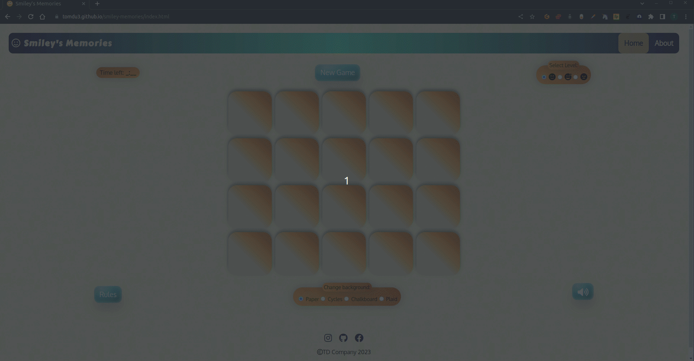
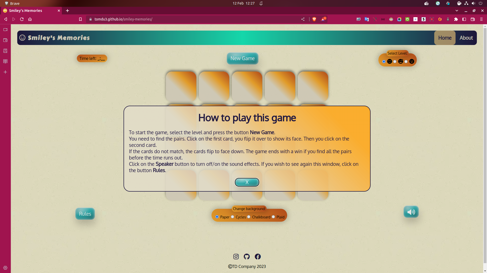

# Smiley's Memories

[View the live project here](https://tomdu3.github.io/smiley-memories/)

## Table of contents
1. [Introduction](#introduction)
2. [UX](#ux)
    1. [Ideal User Demographic](#ideal-user-demographic)
    2. [User Stories](#user-stories)
    3. [Development Planes](#development-planes)
    4. [Design](#design)
3. [Features](#features)
    1. [Design Features](#design-deatures) 
    2. [Existing Features](#existing-features)
    3. [Features to Implement in the future](#deatures-to-implement-in-the-future)
4. [Issues and Bugs](#issues-and-bugs)
5. [Technologies Used](#technologies-used)
    1. [Main Languages Used](#main-languages-used)
    3. [Frameworks, Libraries & Programs Used](#frameworks-libraries-and-programs-used)
6. [Testing](#testing)
    1. [Testing User Stories](#testing-user-stories)
    2. [Manual Testing](#manual-testing)
    3. [Automated Testing](#automated-testing) 
        - [Code Validation](#code-validation)
        - [Browser Validation](#browser-validation)
    4. [User Testing](#user-testing)
7. [Deployment](#deployment)
    1. [Deploying on GitHub Pages](#deploying-on-github-pages)
8. [Credits](#credits)
    1. [Content](#content)
    2. [Media](#media)
    3. [Code](#code)
9. [Acknowledgements](#acknowledgements)

## Introduction

This website allows user to play a Smiley Emoji themed Memory Game. 

This website was made for the second project of the Diploma in Full Stack Software development program at [The Code Institute](https://codeinstitute.net/global/). 

This project is supposed to be responsive and interactive front-end site based on HTML5, CSS3 and JavaScript.

[Back to top ⇧](#)

## UX
### Ideal User Demographic
The ideal user for this website is:
* New User
* Current User

### User Stories
#### New User Goals
1. As a new user, I want to easily navigate the site intuitively. 
2. As a new user, I want the instructions to be easily found, clear and concise.
3. As a new user, I want attractive and relevant visuals and colour schemes that work with the content.
4. As a new user, I want to find sound effects accompanying playing of the game and a possibility  to switch the sound on/off.
5. As a new user, I want to find out something interesting.

#### Current User
1. As a current user, I want to have different difficulty options, to challenge myself.
2. As a current user, I want to have randomly generated card board solution for every new game and every difficulty level.
3. As a current user, I want to easily find instructions how to play game and info about the game.

### Development Planes
To create an interactive website that allows the user to play the game Memory Game, with the option of various game settings to challenge and entertain the user.

#### Strategy
Strategy incorporates user needs as well as product objectives. This website will focus on the following target audience, divided into three main categories:
- **Roles:**
    - New users
    - Current users

- **Demographic:**
    - All ages
    - All puzzle playing levels

- **Psychographic:**
    - Lifestyles:
        - Interest in games
        - Interest in puzzles
    - Personality/Attitudes:
        - Focused
        - Relaxed

The website is supposed to enable the **user** to:
- play the memory game in different difficulties:
  - Difficulty levels are easy, moderate and hard, and they consist in the combination of the number of cards and the time in which all the pairs need to be found:
    - easy - 12 cards, 30 sec;
    - moderate - 20 cards, 60 sec;
    - hard - 30 cards, 90 sec.
- change the background on the homepage:
    - Page themes are  paper, flags, chalkboard and plaid.
- generate a new card field on each new game start:
    - Randomly generated card positions using an algorithm
    
Taking all into consideration, the following strategy table shows the corrispondence of importance and viablity.

Strategy Plane - Viability Table

#### Scope
The scope plane defines requirements based on the goals established on the strategy plane. So, accordingly , the identified required features are broken into the following categories:
- Content Requirements:
  - The user will be looking for:
    - clear and concise instructions.
    - choice of difficulty  layouts; easy, moderate, and hard.
    - choice of page background; paper, flags, chalkboard and plaid.
- Functionality Requirements:
  - The user will be able to:
    - easily navigate the site to find the play instructions (rules).
    - choose the preferences of the game difficulty and background.

#### Structure
The above mentioned information  were  organized in a site map, showing how users can navigate through the site with ease and efficiency:

Site Map

#### Skeleton
The wireframes were created using a desktop version of [Balsamiq](https://balsamiq.com/).

Balsamiq Wireframes

    

### Design
#### Colour Scheme
The default colour scheme was made by [Canva Color Palette Generator](https://www.canva.com/colors/color-palette-generator/).

Colour Palette

    

To that colour scheme, there was added Medium Turquoise colour (#38D2D2) for the buttons with 3d effect from the website [Beautiful CSS buttons examples](https://getcssscan.com/css-buttons-examples).
The same colour was used for the gradient effect on the navbar, with the help of [CSS Gradient](https://cssgradient.io/) web app.

#### Typography
Fonts used on the website are from the [Google Fonts](https://fonts.google.com/), namely **Carter One** and **Oxygen**. Carter One appears in the Logo, whilst Oxygen in the rest of the website.

#### Imagery
The images are taken from the different sources and are credited in the Credits of this file. The main sources were: 
	- [Pixabay](https://pixabay.com/) for the front face of the cards,
	- [Unsplash](https://unsplash.com/) for the image for 404 page.
	- [The Pattern Library](http://thepatternlibrary.com/) for the background images. 

[Back to top ⇧](#)

## Features
### Design Features
Each page within the site has a consistent and responsive navigation system. The details of features on the site are detailed below.
- The **Header**  with the  **Navigation Bar** is positioned at the top of the page.
- The **Footer** stays at the bottom of the screen at all times, on all screen sizes, except when the height of the screen is too small for the cards field. All social media links on the footer open in a new tab. They are Instagram, GitHub and Facebook pages of the developer. The copyright info quotes *TD Company 2023* .

- [Home Page](https://tomdu3.github.io/smiley-memories/index.html)
 is the main game page. Right below the navbar there is a *Time left:* element on the left and *Select Level* on the right with radio button selection. In the middle is a *New Game& button. 
At the first load of the web page, the *modal* window is opened in the middle of the screen, where the rules and features are explained. Modal window can bi closed by clicking on the *x* button.
Upon closing the modal window, the *game field* is revealed. It's not interactive until the *New Game* button is pressed.
Under the game field, there are two buttons on the left and right, in the style of the New Game button. The *Rules* button brings back the modal window, and if the game is on, the timer is paused. After exiting the modal window, the timer continues if it was paused. On the right, there's a *Sound Off/On* button with the Font Awesom icons of a speaker that toggles off/on the sound upon pressing.
In between the buttons, there's a *Change Background* radio button selection menu which activates immediately upon selection and changes the background. 
- [About Page](https://tomdu3.github.io/smiley-memories/about.html)
 is a simple page with a section with h1 title *About Memory Game* at the top in the center, under which there's an image of the first created Memory Card Game. Under it, there's an article  with a simple h2 title *History*, followed by a paragraph that explains the history of the game.
- [404 Page](https://tomdu3.github.io/smiley-memories/404.html)
 is a very simple page with two h1 centered and a funny image of an angry emoji is presented.

**Time left** 
features a countdown during the ongoing game.  The time is hard coded and depends on the selection of the level.

**New Game** 
 button starts the game and renders the game field interactive. It can interrupt the game, thus initializing a new one. The click on the button calls a JavaScript function that draws a game field according to a selected level. The order of the cards is generated randomly.

**Select Level**
 radio selection menu gives the opportunity to a user to select the difficulty of the game. This selection is effective after the New Game button is pressed. The difficulties are represented by the Font Awesome Icons that correspond to an easy, moderate or hard level.

**Game Field**
 is a field generated by the pressing of the New Game button. According to the level, it can be:
	- 3x4 cards (easy);
	- 4x5 cards (moderate);
	- 5x6 cards (hard).

**Rules**
 button reinitiates the modal with the rules and indications for the game and its functionalities.

**Change background**
 radio selection menu changes the background of the web page upon selection. The possible backgrounds are  paper, cycles, chalkboard and plaid.

**Sound Off/On**
 button distincts itself  a Font Awesom icon that represents  a speaker that has a sound wave near itself when the sound is on, or an X when it is off.

### Existing Features
- **Navigation Bar** - Appears on every page for a consistently easy and intuitive navigable system, except of the 404 page.
- **Social Media Icons** - Appearing on every page, the icons are appropriate representations of the Social Media platforms, linking users to the developers Instagram, GitHub and Facebook accounts. The icons appear in the centre of the footer.
- **[Home Page](https://tomdu3.github.io/smiley-memories/index.html "Smiley's Memories")** - Creates a custom Emoji themed Memory Game.
- **[About Page](https://tomdu3.github.io/smiley-memories/about.html "Smiley's Memories - About Memory Game")** - Informing the user of the rules of playing Sudoku.
- **[404 Page](https://tomdu3.github.io/smiley-memories/404.html "Smiley's Memories - 404 Page")** - An emoji themed page that appears when there's page loading 404 error .
- **Sound FX** - The sounds are following the selection, right and wrong guesses, as well as the game won and the game lost event.
- **End Game** - There are two End Game functions, one for losing, other for winning game. The window appears with the corresponding text and a sound effect.

### Features to Implement in the future
**Limiting allowed attempts**
- **Feature** - Would allow even more control and difficulty determination.
- **Reason for not featuring in this release** - There was no time for the developer to combine it with the existing features.

**High Scores**
- **Feature** - It would make the game and the website more interesting and the scores could tracked, saved and be beaten .
- **Reason for not featuring in this release** - This would require more expertise and knowledge from the developer, that is outside the requested parameters of this project. The other reason is the lack of time.

[Back to top ⇧](#)

## Issues and Bugs 
The developer ran into several issues during the development of the website, with the noteworthy ones listed below, along with solutions or ideas to implement in the future.

**Card Flipping Bug** - There was a bug detected that was caused by an EventListener linked with the card selection in combination with a delay of the  back flip of the cards that were wrongly selected. The delay has caused an issue in which allowed a card, that was supposed to flip back, to be selected as a newly chosen second guess, thus causing the switching of the front/back side of the card. The reason for this was that upon the choosing right pair, that pair would be taken from the arrays of nodes, and the delayed flip of the previously wrong card wouldn't be possible because it was removed from the array.
The developer first increased the speed of the flip and decreased the time of the delay. Then, later, he introduced the temporary variables to take the value of the chosen cards in order to avoid the collision with the delayed function.

**Timer Recursion Bug** - A bug was detected when introduced the timer function. Because of the recursive call to the timer method, upon restarting the game, the old timer would collide with the new one and it  would appear a parallel counting that resulted in a timer constantly reproposing different times and thus trying to make them appear at the same time. The Mentor was the one who helped developer to use the function for the clearing interval and the interval id.

**End Game Lose Bugs** - A bug was detected that caused an impossibility to end game by losing if non of the cards were selected.  The first bug waited for the user to click at least one card before ending the game, even if the timer was long at 0. The other bug appeared when the game was lost, and was ended, but the unflipped cards were still clickable. Thus, despite the fact the game was over,  the user could still play. The developer sorted out these bugs by creating a new unplayable field upon the timer reaching 0, so the end of game by losing would be declared and the game couldn't be played until the new game started.

**Timer not stopping after Game Ending Bug** - A bug was detected which allowed timer to continu decrease after the game was over. The developer solved this issue by declearing the time variable outside the timer function, thus allowing the timer to be stopped at any moment (e.g. this functionality was also needed in order to pause the timer upon opening modal window during the active game). 

[Back to top ⇧](#)

## Technologies Used
### Main Languages Used
- [HTML5](https://en.wikipedia.org/wiki/HTML5 "Link to HTML Wiki")
- [CSS3](https://en.wikipedia.org/wiki/Cascading_Style_Sheets "Link to CSS Wiki")
- [JavaScript](https://en.wikipedia.org/wiki/JavaScript "Link to JavaScript Wiki")

### Frameworks, Libraries and Programs Used
- [Canva Color Palette Generator](https://www.canva.com/colors/color-palette-generator/)
	- Canva Color Palette Generator was used to make the initial colour palette.
- [Google Fonts](https://fonts.google.com/ "Link to Google Fonts")
	- Google fonts was used to import the fonts "Special Elite", "Open Sans", "Oswald" and "Nosifer" into the style.css file. These fonts were used throughout the project.
- [Font Awesome](https://fontawesome.com/ "Link to FontAwesome")
	- Font Awesome was used on almost all pages throughout the website to import icons (e.g. social media icons) for UX purposes.
- [GitPod](https://gitpod.io/ "Link to GitPod homepage")
	- GitPod was used for writing code, committing, and then pushing to GitHub.
- [GitHub](https://github.com/ "Link to GitHub")
	- GitHub was used to store the project after pushing
- [Balsamiq](https://balsamiq.com/ "Link to Balsamiq homepage")
	- Balsamiq was used to create the wireframes during the design phase of the project.
- [Am I Responsive?](https://amiresponsive.co.uk/ "Link to Am I Responsive Homepage")
	- Am I Responsive was used to test responsivenes and generate design for the  mockup imagery used at the beginning of this documentation.
 -  [Beautiful CSS buttons examples](https://getcssscan.com/css-buttons-examples)
	- Beautiful CSS buttons was used for the 3d buttons.
-  [CSS Gradient](https://cssgradient.io/)
	- CSS Gradient web app was used to make gradient colour backgrounds.
 - [Webp Converter](https://developers.google.com/speed/webp)
	 - Webp Converter was used to convert images to WEBP format on GitPod.
    [GIMP - GNU Image Manipulation Program](https://www.gimp.org/)
	- GIMP was used to resize the 404 Page image.

[Back to top ⇧](#)

## Testing
### Testing User Stories

#### New User Goals:
1. As a new user, I want to easily navigate the site intuitively.
    - The navigation bar brings to the both of the pages, indicating the current one, and showing the possible selection of the other.
2. As a new user, I want the instructions to be easily found, clear and concise.
    - The rules of the game and instructions are clearly given in the modal window that appears upon first page load, and can be called by clicking on the corresponding button. 
3. As a new user, I want attractive and relevant visuals and colour schemes that work with the content.
    - There is a somewhat engagin, but not overpowering, colour scheme across the site.
    - The user has a choice of theme when at any moment, before, during, or after the game . 
    - The theme choices change the colours of the header, footer and body of the page, if the background is dark.
4. As a new user, I want to find sound effects accompanying playing of the game and a possibility  to switch the sound on/off.
    - As already described above, there are sound effects accompanying the game events, and the relative button that switches them on and off.
5. As a new user, I want to find out something interesting.
    - There is an interesting story on the About Page, and the card images, flipping effects and sound, make this game quite compelling.

#### Current User
1. As a current user, I want to have different difficulty options, to challenge myself.
    - There are different difficulty choices that increase number of the cards. But the corresponding increase of time is not proportional to the increase of number. 
2. As a current user, I want to have randomly generated card board solution for every new game and every difficulty level.
    - Every time the game starts, the shuffle JavaScript function gives a new combination of the order of cards.
3. As a current user, I want to easily find instructions how to play game and info about the game.
    - As mentioned earlier, the modal window with instruction appears on initial page load and can be accessed at any time by clicking on the relative button. The same action would stop the timer, if the game is on, so that the user can calmly go through the text.

[Back to top ⇧](#)

## Manual Testing

### Common Elements Testing
Manual testing was conducted on the following elements that appear on every page:

- Clicking on the Navigation Bar's links will bring the user to the specified page.

Navbar page links

 

- Hovering over the Navigation bar elements will trigger the `hover` effect, highlighting the icon for the user.

Navbar hover effect

     
 
 
- Clicking on the Social Media links will open a new tab

 Instagram:

Instagram Social Media link

 

- GitHub:

GitHub Social Media link

 

- Facebook:

Facebook Social Media link

 

### Home Page
Manual testing was conducted on the following elements of the [Home Page](https://tomdu3.github.io/smiley-memories/):

- Clicking on the New Game button will create a new grid using the user's chosen level settings.

New Game Button -Home Page

 

- Selecting the card pairs successfully, unsuccessfully .

Guessing Pairs

 

- Show the win and lose messages when the game ends.

Game Over - Home Page

 

- Show/hide modal window with Instructions

Modal - Home Page

 

- Sound Off/On Button

Sound Button - Home Page

 

- Change Background Button

Background Change Button - Home Page

 

### Responsiveness
Manual testing was conducted on all three site pages for responsiveness:

- Responsivenss of Home Page.

Resposiveness - Home Page

     
- Responsivenss of About Page.

Resposiveness - About Page

- Responsivenss of 404 Page.

Resposiveness - 404 Page

     
[Back to top ⇧](#)

## Automated Testing

### Code Validation
The [W3C Markup Validator](https://validator.w3.org/) service was used to validate the `HTML` and `CSS` code used. The [JSHint JavaScript Code Quality Tool](https://jshint.com/) was also used to validate the sites `JS` code.

**Results:**

- Home Page

Home Page HTML Validation First Results

Home Page HTML Validation Final Results

- About Page

About Page HTML Validation First Results

About Page HTML Validation Final Results

- 404 Page

404 Page HTML Validation Results

- CSS Stylesheet

Style Sheet Validation First Results

Style Sheet Validation Final Results

- JavaScript 

JavaScript Validation First Results

JavaScript Validation Final Results

### Browser Validation
- Google Chrome

Google Chrome Validation 

- Firefox

Firefox Validation 

- Brave

Brave Validation 

- MS Edge

MS Edge Validation 

- Vivaldi

Vivaldi Validation 

### Lighthouse Validation

- Home Page Lighthouse Validation

Home Page Lighthouse Validation

- Regarding the results of the Accessibility, the issues that are reported are related to the design itself.
    - *Buttons do not have an accessible name* - Sound button has only a Font Awesome Icon, instead of an accessible name.
    - *Form elements do not have associated labels* - It's the same issue, as the previous one. Level selection labels are only Font Awesome Icons.
    The Developer decided to leave these issues unaddressed. The reason to use only symbols rather than words was to give a user a usual feeling of the game. 

- About Page Lighthouse Validation

About Page Lighthouse Validation

- 404 Page Lighthouse Validation

404 Page Lighthouse Validation

## User testing 
Some of my friends, my mentor and a few colleagues from the CI Slack community helped me tested this application. With some of their usefull hints, there were made  some changes to the overall look of the web site.

## Deployment

This project was developed using [GitPod](https://www.gitpod.io/ "Link to GitPod Site"), which was then committed and pushed to GitHub from the terminal.

- The site was deployed to [GitHub](https://github.com/) pages. The steps to deploy are as follows: 
  - In the GitHub repository, navigate to the **Settings** tab 
  - From the left side menu select **Pages**.
  - From the source section drop-down menu, select the **main** branch and click on **save**.
  - Once the main branch has been selected and saved, the page will be automatically refreshed with a detailed ribbon display to indicate the successful deployment. 

The live link can be found here - https://tomdu3.github.io/smiley-memories/.

## Credits 

### Content
- Text for the About Page was taken and adapted from [Board Games Galore Fandom](https://board-games-galore.fandom.com/wiki/Memory)

### Media
**Images**

- The favicon image is taken from [Favicon](https://favicon.io/emoji-favicons/face-with-rolling-eyes/).
- The card images are credited to Christian Dorn and taken from [Pixabay](https://pixabay.com/).
- The image of the original Memory Game is taken from [Reddit](https://www.reddit.com/r/nostalgia/comments/hu50gp/the_original_memory_game/)
- The image for the 404 Page is credited to Andre Hunter and taken from [Unsplash](https://unsplash.com/photos/vm2cwMEiUFA)
- The background images are taken from [The Pattern Library](http://thepatternlibrary.com/).
 
**Sound Files**
- Sound effects were taken from [Freesound](https://freesound.org/)

### Code 
The developer consulted multiple sites to better understand the code they were trying to implement. The following sites were used on a more regular basis:
- [Stack Overflow](https://stackoverflow.com/ )
- [W3Schools](https://www.w3schools.com/ )
- 3d buttons came from [CSS Scan](https://getcssscan.com/css-buttons-examples)
- Modal window code is designed by adapting the code from Kevin Powel's [Dialog = the easiest way to make a popup modal](https://youtu.be/TAB_v6yBXIE)
- Flip card code is an adapted version of the one from Coding with Russ YT Channel video  [Easy Flipcard Tutorial | HTML & CSS](https://youtu.be/NCLdf661ILE)
- Timer code was inspired by the one from Florin Pop's video [Simple Countdown Timer with JavaScript - Day 21](https://youtu.be/x7WJEmxNlEs)
- For the documentation file structure, the main resource was Rebecca Rayner's GitHub repo [Do You Sudoku](https://github.com/Irishbecky91/Do-you-Sudoku)

[Back to top ⇧](#)

## Acknowledgements

- I would like to thank my closest friends, a selected few, who supported me and tested the site. I was helped with the testing with the kindness of  our CI Slack community. Thank you. 
- A special thanks to my mentor Koko (Oluwaseun Owonikoko), who was brilliant as always .
Thanks to Ger Tobin who was giving me good tips everyweek. We'll miss you.

[Back to top ⇧](#)